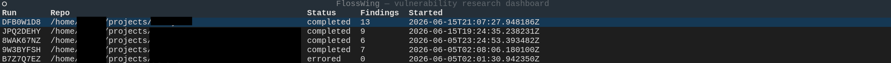

# FlossWing

A local-CLI vulnerability research harness. Point it at a cloned
open-source repository and it runs a multi-stage LLM-agent pipeline
that produces a ranked list of confirmed vulnerabilities with
reproduction PoCs and in-repo reachability analysis.

Inspired by Cloudflare's Project Glasswing harness, adapted for
single-developer, single-repo, BYO-API-key use.

> **Status:** v1 — the eight-stage pipeline (Recon → Hunt → Validate
> → Gapfill → Dedupe → Trace → Report) ships and writes operator-
> facing output. See [ARCHITECTURE.md](ARCHITECTURE.md) for the full
> design and what's deferred to v2.

## What FlossWing is NOT

These are hard non-goals — see [ARCHITECTURE.md § "What FlossWing is
NOT"](ARCHITECTURE.md#what-flosswing-is-not) for the full list.

- Not a service. Local CLI only.
- Not a coding agent. FlossWing never modifies the target repository.
- Not an autonomous discloser. No telemetry, no email, no GitHub
  comments. Disclosure drafts go to stdout for the operator.
- Not a cross-repo system in v1. Reachability traces stop at the
  repo boundary.

## Responsible use & disclosure

FlossWing looks for real, potentially exploitable vulnerabilities in real
software. Use it accordingly:

- **Only scan code you're authorized to scan.** Your own projects, code you
  have explicit permission to test, or public open-source software you're
  researching in good faith. Pointing offensive tooling at third-party systems
  you don't have the right to test may be illegal where you live.
- **Disclose responsibly.** If FlossWing surfaces a real vulnerability in
  software you don't maintain, report it privately to the maintainers and give
  them reasonable time to fix it before sharing any detail publicly. Don't
  publish, sell, or weaponize unfixed findings. FlossWing deliberately never
  contacts anyone on your behalf — what you do with a finding is your decision
  and your responsibility.
- **Findings are candidates, not verdicts.** Every finding comes out of an
  LLM-agent pipeline. The Validate stage re-checks each one and, where possible,
  runs a proof-of-concept in the sandbox — which cuts false positives
  substantially but does **not** eliminate them. Treat every finding as a lead
  to verify by hand, not a confirmed CVE, and expect some misses and some noise.
  You can measure detection quality on a known-vulnerability corpus with
  `flosswing eval` (see below).

## Requirements

- **Python 3.11+**
- **Docker** (primary sandbox backend; Firejail is the fallback).
- One of:
  - `ANTHROPIC_API_KEY` env var, OR
  - `ANTHROPIC_FOUNDRY_API_KEY` env var (Microsoft Foundry routing,
    plus `ANTHROPIC_FOUNDRY_RESOURCE`, `CLAUDE_CODE_USE_FOUNDRY=1`),
    OR
  - A valid `az login` session.
- The target repo cloned locally.

> **Credentials & `.env`:** FlossWing reads auth from the environment. For
> convenience, a `.env` file in the directory you run from is loaded
> automatically at startup — so you can keep your key(s) there instead of
> exporting them each session, and the `flosswing tui` dashboard's "new scan"
> picks them up too. Your already-set environment always takes precedence, and
> `--no-env-file` disables loading. **Keep `.env` out of version control** (it's
> git-ignored by default) — it holds secrets.

> **Cost:** a scan runs a multi-stage Claude (Opus-class) agent pipeline, so it
> consumes meaningful API credit — this is BYO-key and you pay for the tokens.
> As a rough data point, one scan of a mid-sized real-world Python web app
> (tens of thousands of LOC) cost about **$14** in API spend. Cost scales with
> repo size and how many findings get investigated. Every run records its
> actual token/cost usage (shown in the report and the `flosswing tui`
> dashboard), and the per-stage `--*-token-budget` flags cap spend.

## Install

```bash
git clone https://github.com/litobro/FlossWing.git
cd FlossWing
python -m venv .venv
source .venv/bin/activate
pip install -e '.[dev]'
```

## Usage

### Scan a repo

```bash
flosswing scan ./path/to/target-repo
```

This runs the full pipeline and, on success, writes a report
automatically. Output lands in
`~/.flosswing/runs/<run_id>/output/`:

- `report.md` — markdown report, findings ordered by severity then
  reachability.
- `report.json` — `ReportV1` Pydantic projection with
  `schema_version: "1.0"`.
- `findings/<id>/` — per-confirmed-finding directory containing
  `finding.md` (the bug write-up) and `poc.py` (the reproduction
  PoC, when one exists).

State (`runs`, `findings`, `agent_sessions`, etc.) is persisted to
`~/.flosswing/state.db` — a SQLite database you can inspect with
`sqlite3` directly.

#### What a finding looks like

Each confirmed finding gets its own `finding.md`. The example below is
**illustrative — a synthetic finding on invented code, not a real
disclosure** — but matches the exact format FlossWing emits:

```markdown
# Unauthenticated SSRF in the link-preview endpoint

- **id:** `01J9ZQH4M7K2P5R8T3V6X0NDAB`
- **attack class:** ssrf
- **location:** `src/previews/fetch.py`:48-61 — `render_link_preview`
- **badges:** severity: high, confidence: likely, status: confirmed, reachable: reachable

## Description

`render_link_preview` is reachable from the unauthenticated `POST /api/preview`
route. The user-supplied `url` field flows into the outbound HTTP client with no
scheme allowlist, host validation, or egress filtering, so an attacker can drive
the server into issuing arbitrary outbound requests — including to the cloud
instance-metadata service (e.g. `169.254.169.254`) and other internal-only hosts
behind the application's network boundary. The Trace stage confirmed a call path
from the route handler to the sink with no intervening authentication or
validation.

## Suggested fix

Validate the target after DNS resolution, before fetching: require `https`,
reject hosts resolving to private / link-local / loopback ranges, and prefer an
explicit allowlist of permitted domains. Resolving after the check also closes
the DNS-rebinding variant.
```

A sibling `poc.py` is written alongside and executed in the sandbox by the
Validate stage; the example above is abbreviated and omits it.

### Re-render a previous run

```bash
flosswing report <run_id>
```

Re-renders the operator-facing output from the state DB. Useful
after `--no-report`, or after a render failure during the scan.

### Browse runs and findings (interactive dashboard)



```bash
flosswing tui
```

Launches a full-screen terminal dashboard (built on Textual) for
browsing past runs, watching a scan's progress live, and drilling into
findings — a friendlier alternative to reading `state.db` with
`sqlite3`. It is **read-only** over the state DB; the only thing it
mutates is launching `flosswing scan` / `flosswing report` as child
processes, exactly as if you ran them yourself. No daemon, no server,
no network.

Navigation is keyboard-first:

- A **runs list** (newest first) — `enter` opens a run, `n` launches a
  new scan, `r` re-renders a report, `q` quits.
- **Run detail**: pipeline stage progress, token/cost usage, and the
  Hunt task table, refreshed live while a scan is running. `f` opens
  the findings list, `s` the agent sessions, `esc` goes back.
- **Finding detail**: the write-up rendered as Markdown, with the PoC
  code and result, validation verdict, reachability trace, and
  suggested fix.

Needs a real terminal (TTY). The `textual` dependency installs with
the package. Repo-derived text is rendered literally, so untrusted
finding content can't inject terminal markup or open links.

### Score against the eval corpus

Measure detection quality against known-vulnerability ground truth.

```bash
# Re-score an existing run — no API call, fully deterministic.
flosswing eval --from-run <run_id> --corpus v02_smoke

# Run the full pipeline against every registered corpus repo, then score
# (hits the API; operator-run, like the integration tests).
flosswing eval

# Gate on a recall floor — exits non-zero if aggregate recall < 0.8.
flosswing eval --from-run <run_id> --corpus v02_smoke --min-recall 0.8
```

Ground-truth manifests live in `flosswing/eval/ground_truth/<name>.toml`.
A finding counts as a true positive when it matches a ground-truth entry
on file, attack class, and location (within a per-entry line tolerance).

### Common flags

| Flag | Default | Description |
|------|---------|-------------|
| `--no-report` | (off) | Skip end-of-scan auto-render. |
| `--format md,json,sarif` | `md,json` | Pick output formats. `sarif` writes a v1.1 placeholder file. |
| `--output-dir DIR` | `~/.flosswing/runs/<run_id>/output/` | Override the output location. |
| `--recon-token-budget INT` | 100 000 | Per-session input-token cap. Similar flags for `hunt`, `validate`, `gapfill`, `dedupe`, `trace`. |
| `--trace-max-depth INT` | 8 | `find_callers` walk depth before Trace emits `uncertain`. |

`flosswing --help` lists everything.

## Where things live

- **State DB**: `~/.flosswing/state.db`
- **Run scratch dirs**: `~/.flosswing/runs/<run_id>/`
- **Per-run output**: `~/.flosswing/runs/<run_id>/output/`
- **Target repo**: read-only, untouched.

The target repo is treated as **untrusted input** — READMEs,
comments, and source files may contain prompt-injection content.
FlossWing handles this defensively at every stage.

## Project documentation

Operator-curated source-of-truth docs:

- **[ARCHITECTURE.md](ARCHITECTURE.md)** — pipeline stages, component
  boundaries, threat model summary, v1/v2 split.
- **[docs/tool-contracts.md](docs/tool-contracts.md)** — frozen
  agent-facing tool API. Input/output Pydantic models, tool scope
  matrix per stage, error semantics.
- **[docs/schema.sql](docs/schema.sql)** — canonical reference for
  the SQLite state schema.
- **[CLAUDE.md](CLAUDE.md)** — instructions for AI agents (Claude
  Code, etc.) editing this codebase.

## Development

```bash
# Lint + type-check (CI runs both)
ruff check .
mypy --strict flosswing

# Unit tests
pytest tests/unit

# Integration smoke (consumes API credit; gated)
FLOSSWING_INTEGRATION=1 pytest tests/integration
```

CI runs on Python 3.11. The `tree-sitter` grammar bindings pinned in
`pyproject.toml` are 3.11-compatible; newer Python versions may
require local-only grammar fixups.

## License

GNU General Public License v3.0 or later (GPL-3.0-or-later). See
[LICENSE](LICENSE) for the full text.
